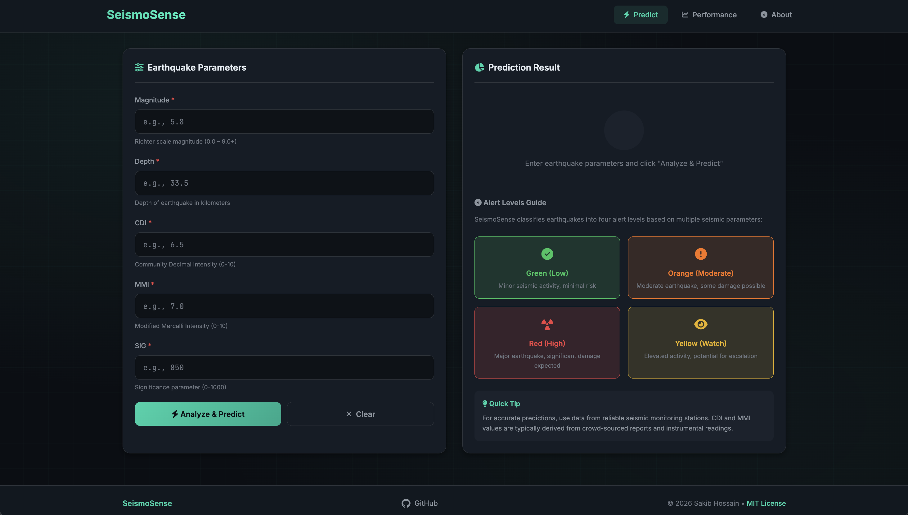
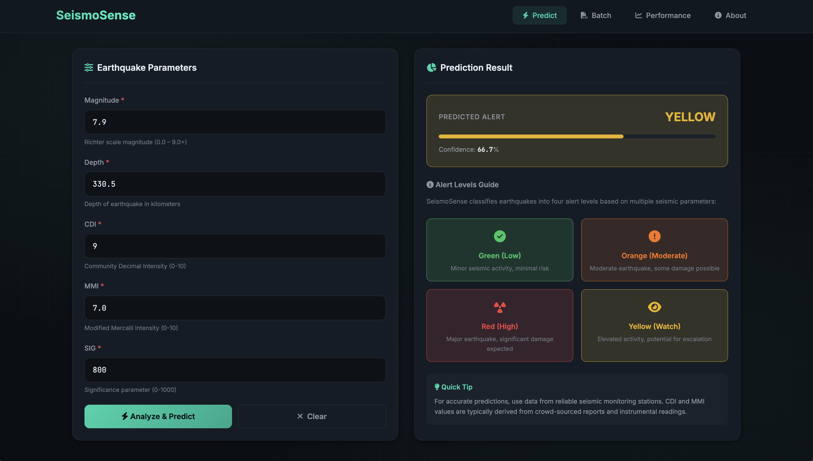

# SeismoSense 🌍

**SeismoSense** is an AI-powered earthquake alert prediction system that leverages machine learning to analyze seismic data and provide instant alert predictions. This project combines cutting-edge ML pipelines, SMOTE oversampling for imbalanced data, and a sleek, futuristic Flask frontend with animated confidence bars.  

---

## 🚀 Features

- Predicts earthquake alert levels (`green`, `orange`, `red`, `yellow`) based on 5 key seismic features:
  - `magnitude`
  - `depth`
  - `cdi` (Community Disaster Index)
  - `mmi` (Modified Mercalli Intensity)
  - `sig` (Significance)
- Multi-model training using:
  - **XGBoost**
  - **Random Forest**
  - **SVC**
  - **KNN**
  - **Bagging Classifier**
- Built-in **SMOTE oversampling** inside the pipeline to handle class imbalance safely.
- **Cross-validation aware** pipeline ensures no data leakage.
- Animated **progress-bar style confidence** for predictions.
- Modern, dark-themed UI inspired by UrbanEcho and CosmoClassifier.

---

## 📸 Screenshots 

1. **Landing Page**  
   

2. **Prediction Result with Confidence Bar**  
   


---

## 🧰 Installation

1. Clone the repo and install dependencies:

```bash
git clone https://github.com/your-username/SeismoSense.git
cd SeismoSense
pip install -r requirements.txt
```

2. Run the Flask app:

```bash
python app.py
```
Open your browser and navigate to [http://127.0.0.1:5000](http://127.0.0.1:5000) to start predicting earthquake alerts!

---

## 🐳 Run the app directly via Dockerhub Image

*Coming Soon.....*

---

## 🧠 Model Performance

The ML pipeline was trained on the **Earthquake Alert Prediction Dataset** using `RandomizedSearchCV` for hyperparameter tuning and **SMOTE** to handle class imbalance.  

**Classification Report on Test Set (260 samples):**

| Label        | Precision | Recall | F1-Score | Support |
|--------------|----------|--------|----------|--------|
| 0 (green)    | 0.89     | 0.83   | 0.86     | 65     |
| 1 (orange)   | 0.88     | 0.98   | 0.93     | 65     |
| 2 (red)      | 0.98     | 0.94   | 0.96     | 65     |
| 3 (yellow)   | 0.86     | 0.85   | 0.85     | 65     |
| **Accuracy** |          |        | **0.90** | 260    |
| **Macro Avg**| 0.90     | 0.90   | 0.90     | 260    |
| **Weighted Avg** | 0.90 | 0.90   | 0.90     | 260    |

> ✅ Achieves 90% accuracy with balanced performance across all alert levels, showing robustness even on imbalanced data.

---

## 📁 Repository Structure

```
SEISMOSENSE/
├── dataset/
│ └── earthquake_data.csv   # Training dataset 
├── models/
│ ├── estimator.pkl         # Trained ML pipeline
│ └── names.pkl             # Feature column names
├── templates/
│ └── index.html            # Frontend code
├── .dockerignore           # Excludes unnecessary files from Docker build
├── .gitignore              # Ignores venv, pycache, logs, etc.
├── app.py                  # Flask server
├── Dockerfile              # Containerizes the app for deployment
├── fit.py                  # ML training script 
├── LICENSE                 # MIT License
├── README.md               # You’re reading it
├── requirements.txt        # Python dependencies
└── research.ipynb       # # Notebook used for testing, visualization and many more
```

---

## ⚙️ Technology Stack

- **Python** 3.13.7

- **Flask** for frontend server

- **scikit-learn** for ML tasks

- **imbalanced-learn** for SMOTE implementation and pipeline

- **XGBoost**, **RandomForest**, **SVC**, **KNN**, **Bagging** for model benchmarking

- **HTML/CSS** for modern UI with animation

- **Docker** for containerized deployment

---

## 🔮 Future Improvements

- Add real-time earthquake data ingestion for live predictions.

- Build a map-based visualization showing predicted alert levels geographically.

- Extend to batch prediction for CSV uploads.

- Add user authentication and log predictions for research purposes.

---

## 📄 License

This project is licensed under the **MIT License** — feel free to use, modify, or extend for personal and research purposes. 

## 😃 Appreciation

Thank you for visting the repository. I’d be thrilled to hear those! You can find my contact info on my [GitHub profile](https://github.com/ByteBard58).

If you liked this project, please consider giving it a star 🌟

Have a great day!