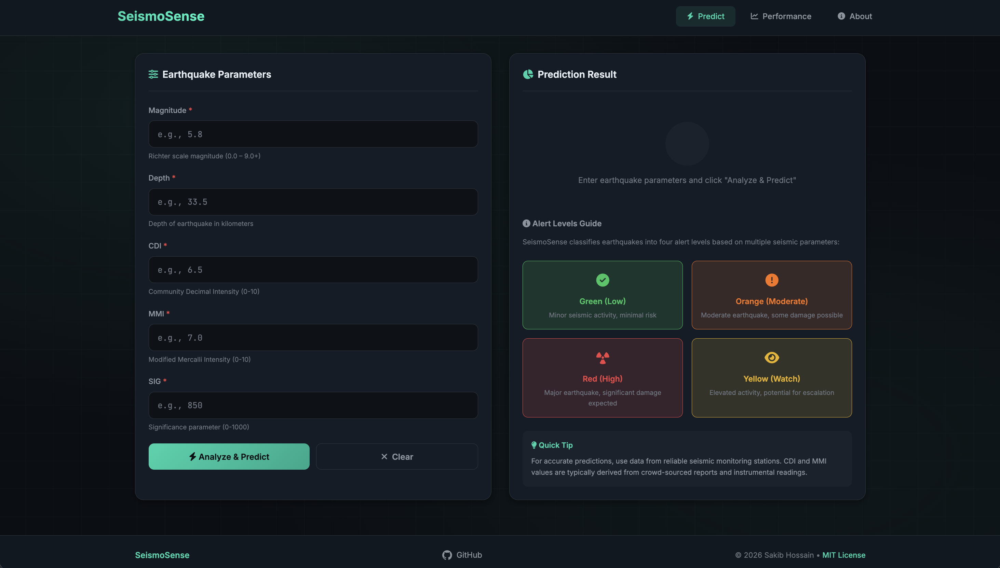
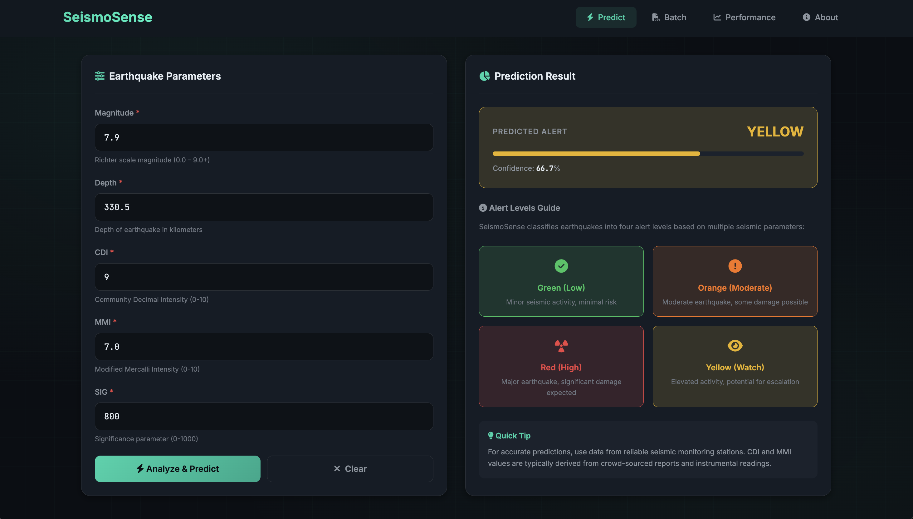

# SeismoSense 🌍

**SeismoSense** is an AI-powered earthquake alert prediction system that leverages machine learning to analyze seismic data and provide instant alert predictions. This project combines cutting-edge ML pipelines, SMOTE oversampling for imbalanced data, and a sleek, futuristic Flask frontend with animated confidence bars.  

---

## 🚀 Features

- Predicts earthquake alert levels (`green`, `orange`, `red`, `yellow`) based on 5 key seismic features:
  - `magnitude`
  - `depth`
  - `cdi` (Community Disaster Index)
  - `mmi` (Modified Mercalli Intensity)
  - `sig` (Significance)
- Multi-model training using:
  - **XGBoost**
  - **Random Forest**
  - **SVC**
  - **KNN**
  - **Bagging Classifier**
- Built-in **SMOTE oversampling** inside the pipeline to handle class imbalance safely.
- **Cross-validation aware** pipeline ensures no data leakage.
- Animated **progress-bar style confidence** for predictions.
- Modern, dark-themed UI inspired by [**UrbanEcho**](https://github.com/ByteBard58/UrbanEcho) and [**CosmoClassifier**](https://github.com/ByteBard58/The_CosmoClassifier).

---

## 📸 Screenshots 

1. **Landing Page**  
   

2. **Prediction Result with Confidence Bar**  
   


---

## 🧰 Installation

1. Clone the repo and install dependencies:

```bash
git clone https://github.com/ByteBard58/SeismoSense.git
cd SeismoSense
pip install -r requirements.txt
```

2. Run the Flask app:

```bash
python app.py
```
Open your browser and navigate to [http://127.0.0.1:5000](http://127.0.0.1:5000) to start predicting earthquake alerts!

3. Run Marimo Notebook (Optional)
To explore the research notebooks interactively:
```bash
marimo edit research.py
```
This command will open the notebook in your default browser. You can then run the cells interactively.

If you just want to see the static notebook with the output of each cell, you can find them in the `reports` directory.

To learn more about Marimo, visit their [official website](https://marimo.io/).


---

## 🐳 Run the app directly via Dockerhub Image

I have used Docker to containerize the SeismoSense web app entirely. The [**Dockerhub repository**](https://hub.docker.com/r/bytebard101/seismosense) allows anyone with any operating system or other system configuration to easily run the app.

The image is built on both ARM64 and AMD64 architectures, so that it can run on almost all major computers and servers. You can run the app easily by using the Dockerhub Image. Here's how you can do it:
1. Install [**Docker Desktop**](https://www.docker.com/products/docker-desktop/) and sign-in. Make sure the app is functioning properly.
  
2. Open Terminal and run:
```bash
docker pull bytebard101/seismosense:latest
docker run --rm -p 5000:5000 bytebard101/seismosense:latest
```
3. If your machine faces a port conflict, you will need to assign another port. Try to run this:
```bash
docker run --rm -p 5001:5000 bytebard101/seismosense:latest
```
> If you followed Step 2 and the command ran successfully, then **DO NOT** follow this step.
4. The app will be live at localhost:5000. Open your browser and navigate to [http://127.0.0.1:5000](http://127.0.0.1:5000/) (or [http://127.0.0.1:5001](http://127.0.0.1:5000/) if you followed Step 3).

Check [Docker Documentation](https://docs.docker.com/) to learn more about Docker and it's commands.

---

## 📊 Dataset Overview

SeismoSense uses the **Earthquake Alert Prediction Dataset** from Kaggle, contributed by **Ahmed Mohamed Zaki**.  
[Dataset link](https://www.kaggle.com/datasets/ahmeduzaki/earthquake-alert-prediction-dataset)  

### Source & Purpose  
The dataset compiles seismic measurements and historical alert levels, aiming to support predictive models for earthquake warning systems. It provides a real world challenge — classification under class imbalance with geophysical features.  

### Features & Target  
| Feature    | Meaning / Description                              |
|------------|----------------------------------------------------|
| magnitude  | Measured strength (Richter or comparable scale)     |
| depth      | How deep the quake was beneath the surface           |
| cdi        | Community Disaster Index (impact-based)             |
| mmi        | Modified Mercalli Intensity (felt intensity)        |
| sig        | Significance metric (statistical/energy measure)    |

- **Target (alert):** The alert classification with four possible categories:
  - `green`  
  - `orange`  
  - `red`  
  - `yellow`  

The original mapping used in the repository is:  
```python
{'green': 0, 'orange': 1, 'red': 2, 'yellow': 3}
```

---

## 🧠 Model Performance

The ML pipeline was trained on the **Earthquake Alert Prediction Dataset** using `XGBClassifier` for hyperparameter tuning and **SMOTE** to handle class imbalance. The model configuration was chosen by running `RandomizedSearchCV`.

**Classification Report on Test Set (260 samples):**

| Label        | Precision | Recall | F1-Score | Support |
|--------------|----------|--------|----------|--------|
| 0 (green)    | 0.89     | 0.83   | 0.86     | 65     |
| 1 (orange)   | 0.88     | 0.98   | 0.93     | 65     |
| 2 (red)      | 0.98     | 0.94   | 0.96     | 65     |
| 3 (yellow)   | 0.86     | 0.85   | 0.85     | 65     |
| **Accuracy** |          |        | **0.90** | 260    |
| **Macro Avg**| 0.90     | 0.90   | 0.90     | 260    |
| **Weighted Avg** | 0.90 | 0.90   | 0.90     | 260    |


---

## 📁 Repository Structure

``` 
SeismoSense/
├─ .github/
│  └─ workflows/
│     ├─ docker.yml
│     └─ python-app.yml
├─ dataset/
│  └─ earthquake_data.csv
├─ models/
│  ├─ estimator.pkl
│  └─ names.pkl
├─ reports/
│  └─ research.html
├─ screenshots/
│  ├─ landing.png
│  └─ prediction_1.png
├─ static/
│  ├─ confusion_matrix.png
│  ├─ script.js
│  └─ style.css
├─ templates/
│  └─ index.html
├─ .dockerignore
├─ .gitattributes
├─ .gitignore
├─ app.py
├─ conf_mat.py
├─ Dockerfile
├─ fit.py
├─ LICENSE
├─ README.md
├─ requirements.txt
├─ research.py
└─ tree.md
```

---

## ⚙️ Technology Stack

- **Python** 3.13.7

- **Flask** for frontend server

- **scikit-learn** for ML tasks

- **imbalanced-learn** for SMOTE implementation and pipeline

- **XGBoost**, **RandomForest**, **SVC**, **KNN**, **Bagging** for model benchmarking

- **HTML/CSS** for modern UI with animation

- **Docker** for containerized deployment

---

## 📄 License

This project is licensed under the **MIT License** — feel free to use, modify, or extend for personal and research purposes. 

## 😃 Appreciation

Thank you for visting the repository. I’d be thrilled to hear those! You can find my contact info on my [GitHub profile](https://github.com/ByteBard58).

If you liked this project, please consider giving it a star 🌟

Have a great day!
